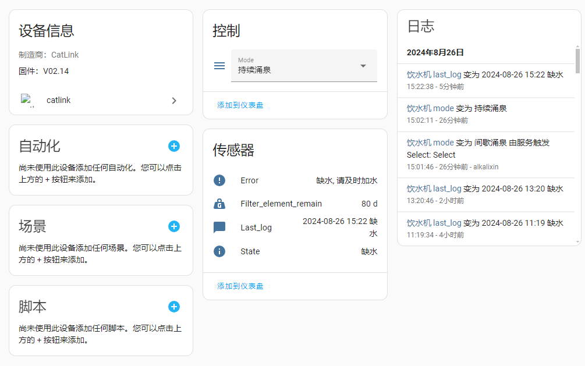

# Catlink for HomeAssistant

## Introduction

This project is based on [fuz2er/catlink](https://github.com/fuz2er/catlink)，and
adds `Water Fountain Support`

## Installing

> [Download](https://github.com/alkalixin/catlink/archive/main.zip) and copy `custom_components/catlink` folder
> to `custom_components` folder in your HomeAssistant config folder

```shell
# Auto install via terminal shell
wget -q -O - https://cdn.jsdelivr.net/gh/al-one/hass-xiaomi-miot/install.sh | DOMAIN=catlink REPO_PATH=alkalixin/catlink ARCHIVE_TAG=main bash -
```

## Config

> Recommend sharing devices to another account


## Devices

### Scooper


### Feeder


### Water Fountain

